```{r}
options(width = 60)
set.seed(0)
```

## Digital Manufacturing

- DM is the evolution of manufacturing, where an integrated approach is centered around a computer system
- Evolution: purely mechanical machinery ➡︎ CNC machines ➡︎ systems of computer-controlled machines
- DM goes within the framework of Industry 4.0
- Industry 4.0 is the 4th industrial revolution

## Evolution of manufacturing

:::: {.columns}
::: {.column width="50%"}
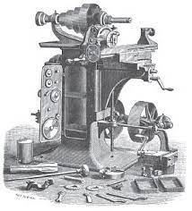{height=190}

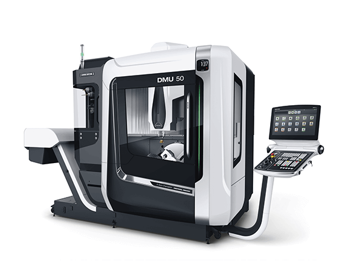{height=190}
:::
::: {.column width="50%"}
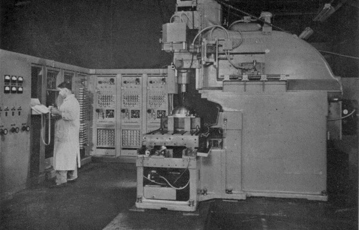{height=190}

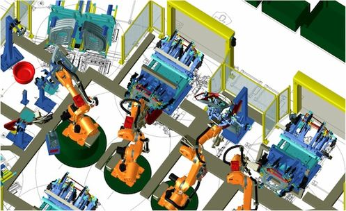{height=190}
:::
::::

## Industry 4.0

- **Motivation** --- reaction from EU and USA to 2008 economical crisis
- **Name origin** --- 2011 Hannover Messe (Angela Merkel)


::: {.columns}

::: {.column}
- Hannover Messe 2013 --- presentation of **final report** of the *Industrie 4.0* committee, **tasked by German government** in 2011:
  - Design principles
  - Challenges
  - Impacts
:::

::: {.column}
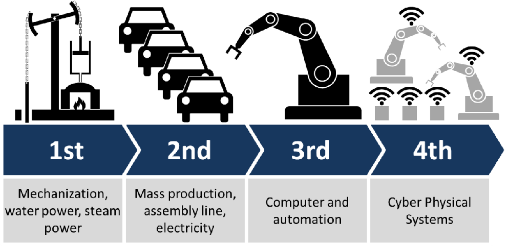{fig-align="center" height=200}
:::

:::


## Previous industrial revolutions

:::: {.columns}
::: {.column width="33%"}
**First Industrial Revolution**

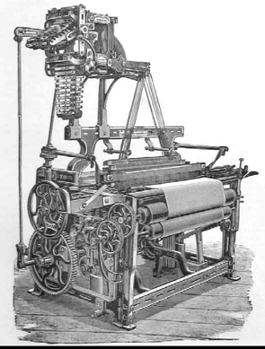{width=90%}
:::
::: {.column width="34%"}
**Second Industrial Revolution**

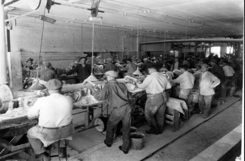{width=65%}

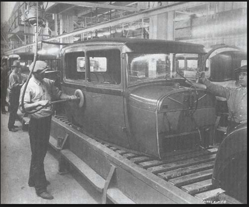{width=65%}
:::
::: {.column width="33%"}
**Third Industrial Revolution**

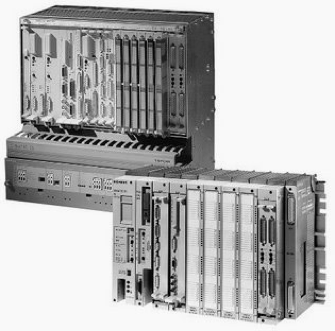{width=90%}
:::
::::

## Industry 4.0

**Objectives:**

- Re-shoring of added value in western countries
- Sustain salaries of working- and middle-class
- Sustain e-commerce
- Mass customization (added value shifts from manufacturing to design)
- Time compression (life cycle of a car from 5 to 2 years)

## Industry 4.0

**Design principles:**

- Interoperability (IoT, IIoT, IoP)
- Cyber-Physical Systems (CPS)
- Information transparency: public, open protocols; digital twins
- Self-support and in-line help to operators
- Decision de-centralization: autonomy, stratification, prioritization

## Industry 4.0

**Design principles:**

| Order | Human attribute | Example |
| - | - | ----- |
| 0 | None | Manual tools |
| 1 | Energy | Powered machines and tools |
| 2 | Dexterity | Single-cycle automatics (*dexterity = self-feeding*) |
| 3 | Diligence | Repeats cycle; open-loop control |
| 4 | Judgment | Closed loop; numerical control; self-measuring |
| 5 | Evaluation | Computer control; model of process required for automation |
| 6 | Learning | Limited self-programming; some artificial intelligence |
| 7 | Reasoning | Inductive reasoning (cause-effects) |
| 8 | Creativity | Performs (original) design unaided |
| 9 | Dominance | Machine is master (HAL 9000) |

: Akin to the *Yardstick of Automation* (Amber & Amber, 1962) {.striped .hover}

## Industry 4.0

**Challenges:**

- Cybersecurity
- Reliability and resiliency of M2M communication (bandwidth and latency)
- Drop-in, plug-in approach on existing processes
- Intellectual property (IP) protection
- Reluctancy to change, operators re-training
- Corporate IT
- Initial loss of labor

## Industry 4.0

**Impacts:**

- Servitization (from selling goods to selling services)
- Productivity, and its resilience
- Safety
- Integrated design of product/process
- Cost structure
- Socio-economical factors
- Big Data analytics

## Digital Manufacturing

Some core, enabling technologies are grounding I4.0 and DM:

- Cyber-Physical Systems (M2M connectivity)
- IIoT (connectivity layer)
- Additive Manufacturing (dematerialization of design)
- Machine Learning and AI (autonomous decisions)

## Digital Manufacturing

- **Cyber-Physical Systems:** in short, they are mechatronic systems, i.e., mechanisms, whose actuators are controlled by a computer system based on output from sensors and logics provided by algorithms
- I4.0/DM-enabled CPS must be IoT-connected
  - Provide the plant controller with information on its own status
  - Accept incoming tasks

## Digital Manufacturing

- **Industrial Internet of Things (IIoT):** has to support communications among CPSs (M2M communication)
- IP protocol: IPv4 has $2^{32} \simeq 4.3 \times 10^9$ addresses, IPv6 has $2^{128} \simeq 3.4 \times 10^{39}$ addresses. IPv6 adoption is slow because of NAT and its rescue for IPv4 addresses exhaustion problem

## OSI Networking Model

- Networking stack: according to the Internet model, networking happens over a stack of 4 layers


::: {.columns}

::: {.column}
  - **Link layer** (L0): physical carrier (Ethernet Cable, WiFi, etc) and its protocol (MAC, 802.11, ARP, etc)
  - **Internet (or network) layer** (L1): IPv4, IPv6, ICMP
  - **Transport layer** (L2): TCP, UDP
  - **Application layer** (L3): HTTP, FTP, IMAP, LDAP, ...
:::

::: {.column}
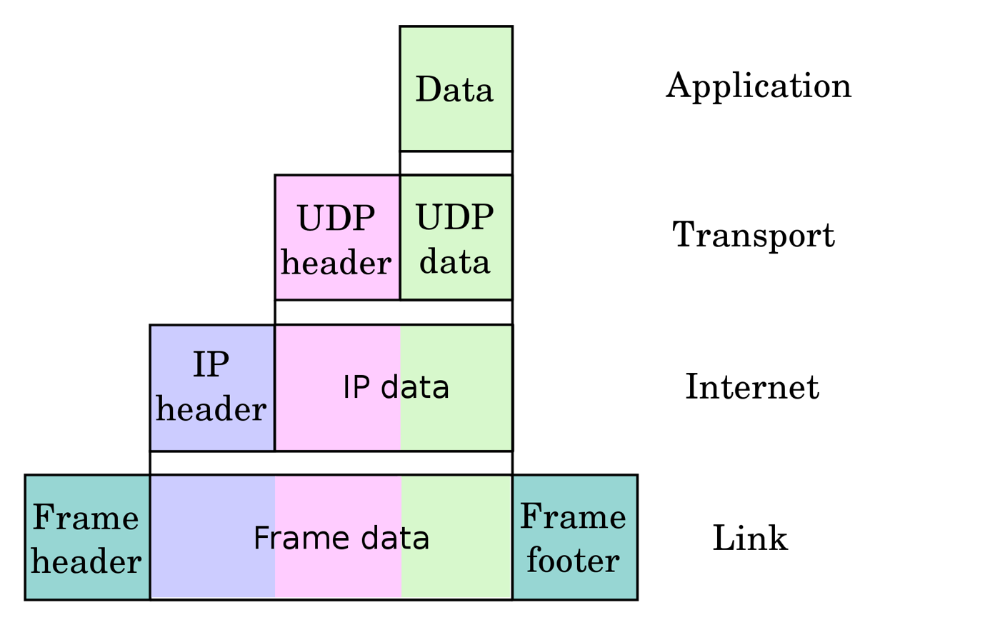{fig-align="right" height=280}
:::
:::


## Digital Manufacturing

- **Industrial Internet of Things (IIoT):** has to support communications among CPSs (M2M communication)
- **Level 0 protocols:** 5G (low latency!)
- **IP protocol (L1):** beside address space, IPv6 has other advantages (complex multicasting, autoconfiguration, IPsec). Its adoption is still slow, though
- **Level 3 protocols:** from REST (HTTPS) to lightweight protocols (MQTT, ZeroMQ, AMQP, OPC-UA)

## REST vs Message Queuing


::: {.columns}

::: {.column}
- **RE**presentational **S**tate **T**ransfer: IoT extension of HTTP
  - Verbose (large overhead)
  - Complex (PUT/GET/POST/DELETE)
  - Polling-based
  - Point-to-point (*n* clients to 1 server)
:::

::: {.column}
{fig-align="center" height=170}
:::

:::


## HTTP overhead

:::: {.columns}
::: {.column width="50%"}
Request phrase: `GET / HTTP/1.1` (14 × 2 bytes)

The HTTP frame takes 153 bytes total

The full request stack takes 437 bytes
:::
::: {.column width="50%"}
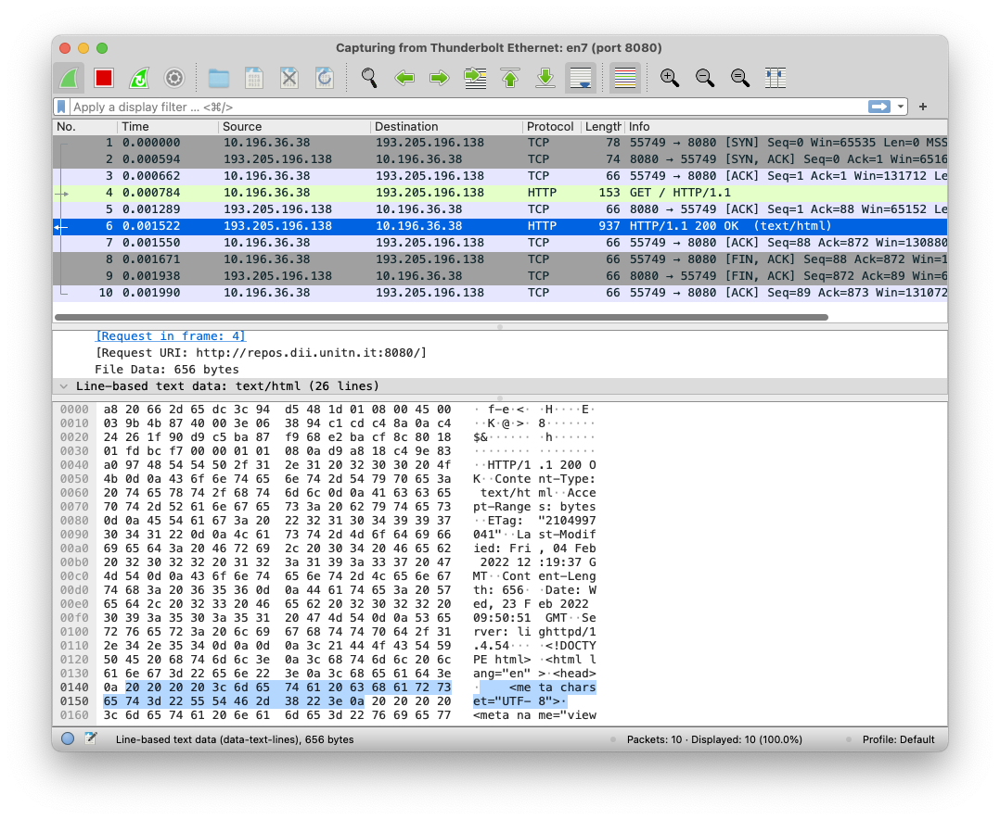{height=470}
:::
::::

## HTTP overhead

:::: {.columns}
::: {.column width="50%"}
Response phrase: 77 bytes + HTML

The whole HTTP frame takes 937 bytes (including 819 bytes of HTML)

The full response stack takes 1201 bytes, 382 bytes for a blank page
:::
::: {.column width="50%"}
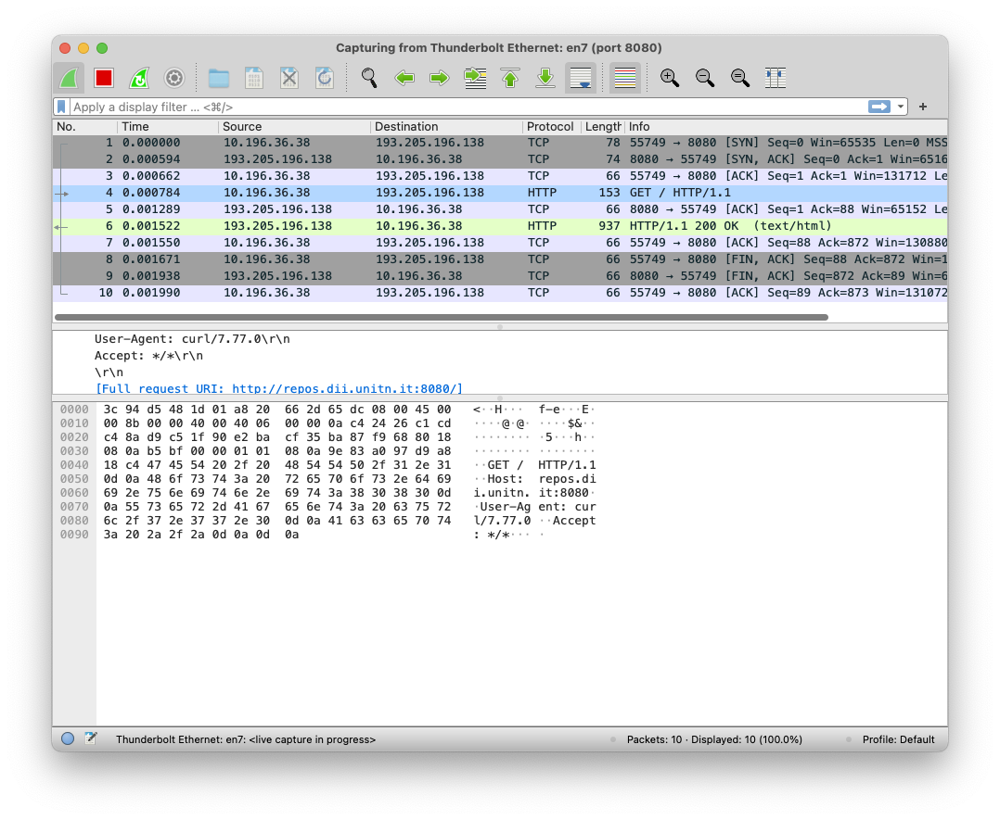{height=470}
:::
::::

## How to reduce overhead

- Simpler transport layer (L2) protocol: UDP has no SYN/ACK/FIN frames (but no confirmation of delivery!)

**AND/OR**

- Simpler application layer (L3) protocols, where the data frame is as naked as possible
- Trade reliability and robustness for bandwidth and latency

## How to reduce overhead

- Reliability and robustness are very important for IoP communications: variety of web servers, web browsers and document formats, and the web must "just work"
- They are also important in IoT (things must do their tasks) but we can enforce standards and minimize possible sources of unexpected conditions

## REST vs Message Queuing

:::columns
:::column
- IoT messages are typically smaller but much more frequent than IoP messages, and **may need to follow routes more complex than n-to-1** (client**s**--server)
  - Need to minimize overhead
  - Need to support flexible topologies
- Message Queuing protocols (like MQTT and ZeroMQ)
:::

:::column
```{mermaid}
%%| fig-align: center
flowchart LR
  P1[Publisher] --> B[Broker]
  P2[Publisher] --> B
  B --> S1[Subscriber]
  B --> S2[Subscriber]
  B --> S3[Subscriber]
  B --> S4[Subscriber]
```
:::
:::

## REST vs Message Queuing

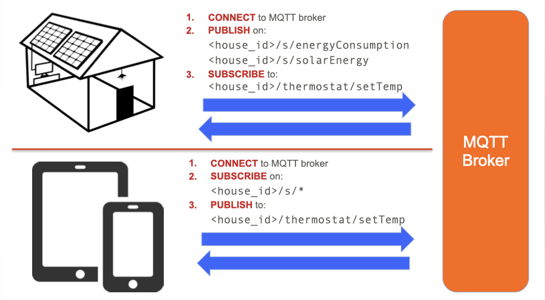{fig-align="center" height=500}

## Digital Manufacturing

- **Conventional machining:** Designer ➡︎ CAM operator ➡︎ CNC machine tool
- **Additive Manufacturing:** Designer ➡︎ Machine tool (printer)
- Entirely digital workflow

## Digital Manufacturing

**Machine Learning and Artificial Intelligence:**

- Classification of operating conditions
- Autonomous and de-centralized decision making
- Level 7 automation on Amber & Amber's scale

## Course Matter

:::: {.columns}
::: {.column width="25%"}
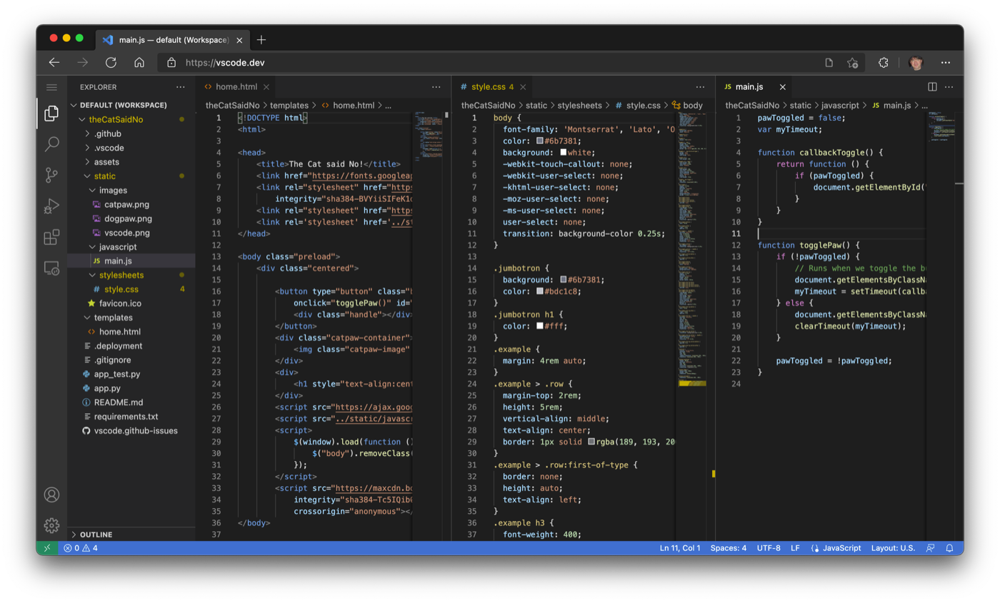{height=180}
:::
::: {.column width="25%"}
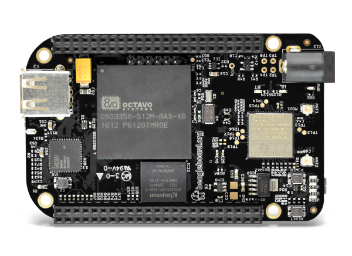{height=180}
:::
::: {.column width="25%"}
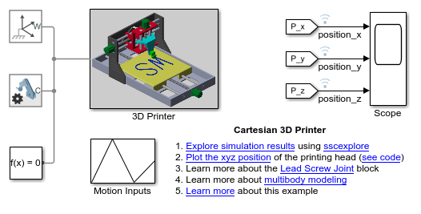{height=180}
:::
::: {.column width="25%"}
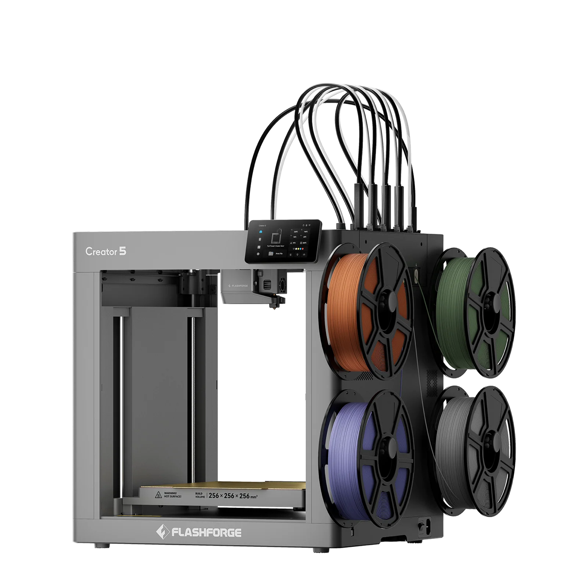{height=180}
:::
::::

Development and testing ➡︎ Deployment ➡︎ (ZeroMQ) ➡︎ CPS simulation, and/or 3D printer

## Tools

- Programming in C++: high performance, general purpose language, suitable for real-time systems (controllers), more complex to learn than C (bigger) but more abstract (does not need understanding of hardware)
- GNU-Unix toolchain (much more common than Windows in automation)
  - Linux exposed via WSL in Windows (MacOS is UNIX already)
  - And/or custom machine simulator (faster)

## Teaching Material

:::: {.columns}
::: {.column width="50%"}
- All teaching materials are provided via Moodle
- Software will be made available on GitHub platform
- Reference textbook is *Manufacturing Automation*, by Y. Altintas (2000), available @BUM (2 copies)
:::
::: {.column width="50%"}
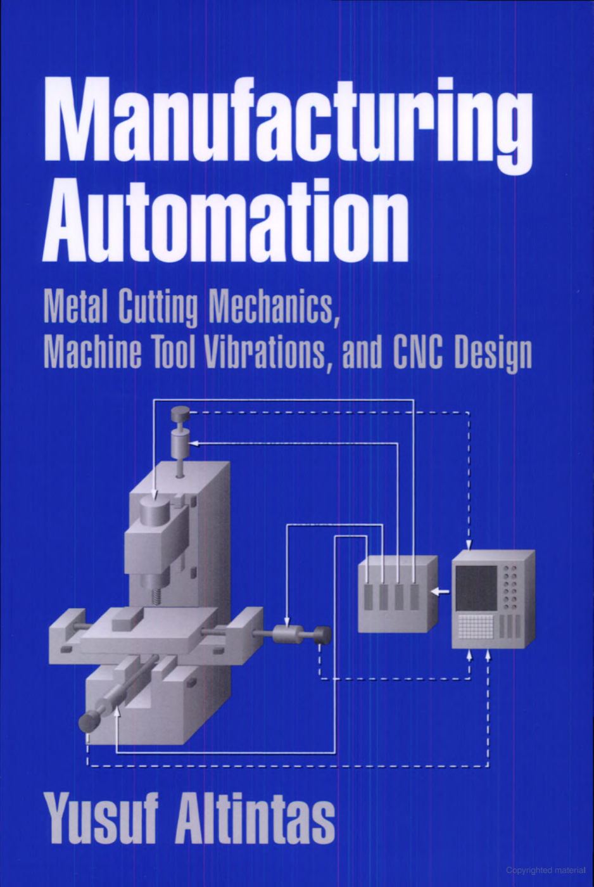{height=480}
:::
::::

## Exam

- Each Session is made up by a mandatory written exam and an optional oral exam
  - **Written exam:** on Moodle platform, max 26/30
  - **Oral exam:** optional, max 30L/30, must be given in the same session
- **Final mark:** starting from written mark, oral exam can improve or degrade it
