```{r}
options(width = 60)
set.seed(0)
```

## C Programming recap {.smaller}

:::: {.columns}
::: {.column width="58%"}
```{.c code-line-numbers="1-2"}
#include <stdlib.h>
#include <stdio.h>

int main(int argc, char const *argv[]) {
  /* declarations */
  double result, factor[2];
  unsigned int i;
  int result = 0;

  // code
  if (argc != 3) {
    fprintf(stderr, "I need two arguments, got %d\n", argc);
    result = -1;
  }
  for (i = 0; i < 2; i++) {
    factor[i] = atof(argv[i + 1]);
  }
  result = factor[0] * factor[1];
  printf("%f * %f = %f\n", factor[0], factor[1], result);

  return result;
}
```
:::
::: {.column width="42%"}
- keywords starting with "`#`" are **preprocessor directives**
- `#include` loads locally an external C file
- `#include <...>` searches in system path
- `#include "..."` searches locally
:::
::::

## C Programming recap {.smaller}

:::: {.columns}
::: {.column width="58%"}
```{.c code-line-numbers="4,22"}
#include <stdlib.h>
#include <stdio.h>

int main(int argc, char const *argv[]) {
  /* declarations */
  double result, factor[2];
  unsigned int i;
  int result = 0;

  // code
  if (argc != 3) {
    fprintf(stderr, "I need two arguments, got %d\n", argc);
    result = -1;
  }
  for (i = 0; i < 2; i++) {
    factor[i] = atof(argv[i + 1]);
  }
  result = factor[0] * factor[1];
  printf("%f * %f = %f\n", factor[0], factor[1], result);

  return result;
}
```
:::
::: {.column width="42%"}
- Functions are **declared** with:
  - return type
  - name
  - list of arguments
- Functions are **defined** with:
  - everything above
  - plus body
:::
::::

## C Programming recap {.smaller}

:::: {.columns}
::: {.column width="58%"}
```{.c code-line-numbers="4"}
#include <stdlib.h>
#include <stdio.h>

int main(int argc, char const *argv[]) {
  /* declarations */
  double result, factor[2];
  unsigned int i;
  int result = 0;

  // code
  if (argc != 3) {
    fprintf(stderr, "I need two arguments, got %d\n", argc);
    result = -1;
  }
  for (i = 0; i < 2; i++) {
    factor[i] = atof(argv[i + 1]);
  }
  result = factor[0] * factor[1];
  printf("%f * %f = %f\n", factor[0], factor[1], result);

  return result;
}
```
:::
::: {.column width="42%"}
- `int main(int, char const **)` is the mandatory entry point for any C program
- `argc` is the number of arguments received from command line, plus 1
- `argv[]` is the array of arguments
- `argv[0]` is the program name
:::
::::

## C Programming recap {.smaller}

:::: {.columns}
::: {.column width="58%"}
```{.c code-line-numbers="5,10"}
#include <stdlib.h>
#include <stdio.h>

int main(int argc, char const *argv[]) {
  /* declarations */
  double result, factor[2];
  unsigned int i;
  int result = 0;

  // code
  if (argc != 3) {
    fprintf(stderr, "I need two arguments, got %d\n", argc);
    result = -1;
  }
  for (i = 0; i < 2; i++) {
    factor[i] = atof(argv[i + 1]);
  }
  result = factor[0] * factor[1];
  printf("%f * %f = %f\n", factor[0], factor[1], result);

  return result;
}
```
:::
::: {.column width="42%"}
Comments can be:

- `// single line`
- `/* multiline */`
:::
::::

## C Programming recap {.smaller}

:::: {.columns}
::: {.column width="58%"}
```{.c code-line-numbers="11-14"}
#include <stdlib.h>
#include <stdio.h>

int main(int argc, char const *argv[]) {
  /* declarations */
  double result, factor[2];
  unsigned int i;
  int result = 0;

  // code
  if (argc != 3) {
    fprintf(stderr, "I need two arguments, got %d\n", argc);
    result = -1;
  }
  for (i = 0; i < 2; i++) {
    factor[i] = atof(argv[i + 1]);
  }
  result = factor[0] * factor[1];
  printf("%f * %f = %f\n", factor[0], factor[1], result);

  return result;
}
```
:::
::: {.column width="42%"}
Conditionals:

```c
if (condition) {
  /* code */
} else if (condition) {
  // code
} else {
  // other code
}
```
:::
::::

## C Programming recap {.smaller}

:::: {.columns}
::: {.column width="58%"}
```{.c code-line-numbers="15-17"}
#include <stdlib.h>
#include <stdio.h>

int main(int argc, char const *argv[]) {
  /* declarations */
  double result, factor[2];
  unsigned int i;
  int result = 0;

  // code
  if (argc != 3) {
    fprintf(stderr, "I need two arguments, got %d\n", argc);
    result = -1;
  }
  for (i = 0; i < 2; i++) {
    factor[i] = atof(argv[i + 1]);
  }
  result = factor[0] * factor[1];
  printf("%f * %f = %f\n", factor[0], factor[1], result);

  return result;
}
```
:::
::: {.column width="42%"}
Loops:

```c
for (start; cond; incr) { /* code */ }
while (true) { // }
do { // } while (true)
```
:::
::::

## C Programming recap {.smaller}

:::: {.columns}
::: {.column width="58%"}
```{.c code-line-numbers="12,19"}
#include <stdlib.h>
#include <stdio.h>

int main(int argc, char const *argv[]) {
  /* declarations */
  double result, factor[2];
  unsigned int i;
  int result = 0;

  // code
  if (argc != 3) {
    fprintf(stderr, "I need two arguments, got %d\n", argc);
    result = -1;
  }
  for (i = 0; i < 2; i++) {
    factor[i] = atof(argv[i + 1]);
  }
  result = factor[0] * factor[1];
  printf("%f * %f = %f\n", factor[0], factor[1], result);

  return result;
}
```
:::
::: {.column width="42%"}
Output: `printf`, `fprintf`, `sprintf`, `asprintf`

Channels:

- `stdout`
- `stderr`
- `FILE` pointer
:::
::::

## C Programming recap {.smaller}

:::: {.columns}
::: {.column width="58%"}
```{.c code-line-numbers="16"}
#include <stdlib.h>
#include <stdio.h>

int main(int argc, char const *argv[]) {
  /* declarations */
  double result, factor[2];
  unsigned int i;
  int result = 0;

  // code
  if (argc != 3) {
    fprintf(stderr, "I need two arguments, got %d\n", argc);
    result = -1;
  }
  for (i = 0; i < 2; i++) {
    factor[i] = atof(argv[i + 1]);
  }
  result = factor[0] * factor[1];
  printf("%f * %f = %f\n", factor[0], factor[1], result);

  return result;
}
```
:::
::: {.column width="42%"}
Input:

- from command line (`argv`)
- from environment
- from files
- from sockets
- from `stdin`

Never interactive (`gets()`, `scanf()`)
:::
::::

## C Compound Types

- **Structs:** for collecting many variables in a single "object"
- **Unions:** for accessing the same memory as if it were of different types
- **Enums:** for finite set of symbols

## Best Practices {.smaller}

:::: {.columns}
::: {.column width="58%"}
```{.c code-line-numbers="false"}
#include <stdlib.h>
#include <stdio.h>

int main(int argc, char const *argv[]) {
/* declarations */
double result, factor[2];
  unsigned int i;
  int result = 0;

  // code
  if(argc!=3){
  fprintf(stderr, "I need two arguments, got %d\n", argc);
  result=-1;
  }
  for (i = 0; i < 2; i++) {
            factor[i] = atof(argv[i + 1]);
  }
  result = factor[0] * factor[1];
  printf("%f * %f = %f\n", factor[0], factor[1], result);

  return result;
}
```
:::
::: {.column width="42%"}
- Proper indentation (if not, < 18/30)
- Proper spacing
- On Visual Studio Code, use *Format Document*
:::
::::

**Compare this with code in previous slides!**

## Best Practices

- Put variables declarations at the beginning of each block
- Only one exit point per function (except for errors)
- Factorize code (= Don't Repeat Yourself: DRY)
- Use clean, extended names for functions and variables of general usage (short names OK for local variables)

## From Source to Runtime

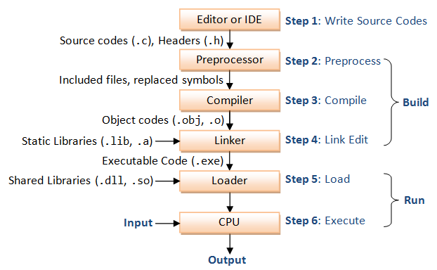{fig-align="center" height=540}

## From Source to Runtime

- **C Header files (.h)** --- elegant solution for:
  - organizing code on many files
  - reusing code, even in form of compiled library
- On build-time, only headers are used
- On link-time and runtime, only libraries are needed and used (no headers)

## Building your code

Build command needs:

**Build time**

- switches for compile configuration
- location of system and special header files
- list of files to compile

**Link time**

- switches for linking configuration
- location of system and special libraries
- list of files to link

## Building your code {.smaller}

Typical compilation command:

```bash
clang [options] -Ipath/to/includes -Lpath/to/libs -llibrary_name \
  -o output_file source1.c source2.c source3.c
```

- Most common compilers are `gcc` and `clang` (we'll use `clang`)
- The `[options]` list and the list of source files can be long and tedious to type

## Building assistants: IDE or CLI {.smaller}

- **GNU Make:** command-line program for building complex projects via special scripts called *Makefiles*. A Makefile is typically complex to write and maintain
- **CMake:** command-line program that takes a configuration file (`CMakeLists.txt`) and generates a temporary building environment (typically using GNU Make). Easier to write and maintain than Makefile

## CMake Script

:::: {.columns}
::: {.column width="30%"}
Steps:

- project setup
- define common switches
- define headers and library locations
- define targets
- define install behavior
:::
::: {.column width="70%"}
::: {.tiny}
```{.cmake code-line-numbers="false"}
cmake_minimum_required(VERSION 3.9)
set(CMAKE_C_COMPILER "clang")
# Set project name, version, and language
project(C-CNC VERSION 0.0.1 LANGUAGES C)
# Set common compile options and preprocessor definitions
add_compile_options(-std=gnu11 -fPIC)
add_definitions(-D_GNU_SOURCE)
# Define the list of source files
set(SOURCE_DIR ${CMAKE_HOME_DIRECTORY}/src) #set a variable
file(GLOB LIB_SOURCES "${SOURCE_DIR}/*.c") #put into LIB_SOURCES the globbed list
# Parametrically create some file from template
configure_file(
  ${SOURCE_DIR}/version.h.in
  ${SOURCE_DIR}/version.h
)
# define header directories
include_directories(
  ${CMAKE_HOME_DIRECTORY}/machine/src
)

# Define TARGETS, i.e. output objects
# Library target:
add_library(ccnclib STATIC ${LIB_SOURCES})
target_link_libraries(ccnclib machine)
# Main executable
add_executable(ccnc ${SOURCE_DIR}/main/ccnc.c)
add_dependencies(ccnc ccnclib)
target_link_libraries(ccnc ccnclib)

# INSTALL
set(CMAKE_INSTALL_PREFIX ${CMAKE_HOME_DIRECTORY})
install(TARGETS ccnclib ccnc
  RUNTIME DESTINATION bin
  LIBRARY DESTINATION lib
  ARCHIVE DESTINATION lib
)
```
:::
:::
::::

## CMake

Building with `cmake` takes 2+1 steps:

- Configuration: `cmake -Bbuild_dir`
- Building: `cmake --build build_dir`
- Installing: `cmake --build build_dir -t install`

Alternatively, after configuration, `make` can be used:

- `make -Cbuild_dir`
- `make -Cbuild_dir install`

## Programming C as a Pro

**Problem 1:**

- complex programs are made of many functions that have to pass around data. C function arguments are passed by value (i.e. copied!)
- for good performance you need to minimize info passed by functions

**Solution:** learn to use pointers

## Programming C as a Pro

**Problem 2:**

- C function can only return a single value
- C functions cannot return compound types (arrays!)

**Solution:** learn to use pointers

## Programming C as a Pro

**Problem 3:**

- complex programs are made of many functions
- they also depend on external libraries
- the code must be readable and understandable

**Solution:** carefully distribute code in different files, and use flexible build software

## Stack vs. Heap memory

:::: {.columns}
::: {.column width="50%"}
{fig-align="center" height=330}

FIFO access (fast)

Typ. ~8 Mb capacity per thread (check with command `ulimit -s`)
:::
::: {.column width="50%"}
{fig-align="center" height=330}

Random access (slower)

Virtually unlimited
:::
::::

## Tricky Pointers

- Standard variables are defined on the **stack** memory
- You get the pointer to variable `var` with `&var`
- You get the value of pointer `var_p` with `*var_p`
- Arrays are pointers to their first element, but stack arrays have a limited maximum size (system dependent)
- Variables on stack are eliminated from memory on exiting from local scope

## Tricky Pointers

- Pointers requiring large (or dynamic) memory can be defined on the **heap** memory
- You allocate a pointer on the heap with the `malloc()` family of functions
- `malloc`'d variables are **not** freed upon exiting from local scope
- For every `malloc()` you need one `free()`, or you have a **memory leak** ☠️☠️☠️

## Ways for returning an array in C

- Use `malloc()` in the caller and pass the pointer as an *inout* argument (easier)
- Call `malloc()` inside the function and return that pointer (easy, but you cannot return anything else, like error status)
- Pass a double pointer to the callee as an *inout* argument, use `malloc()` inside the function (not so easy, but you can also return a status value)

## NOT SO easy: Case one (not working)

## Case one --- step 1

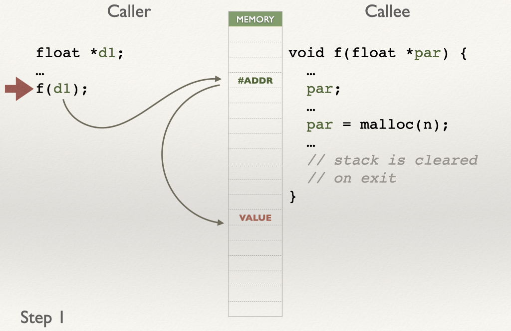{fig-align="center" height=540}

## Case one --- step 2

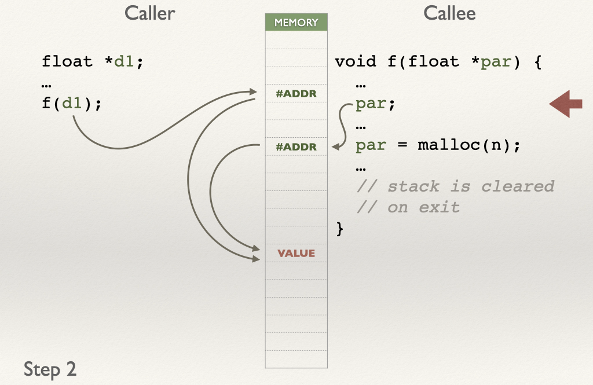{fig-align="center" height=540}

## Case one --- step 3

{fig-align="center" height=540}

## Case one --- step 4

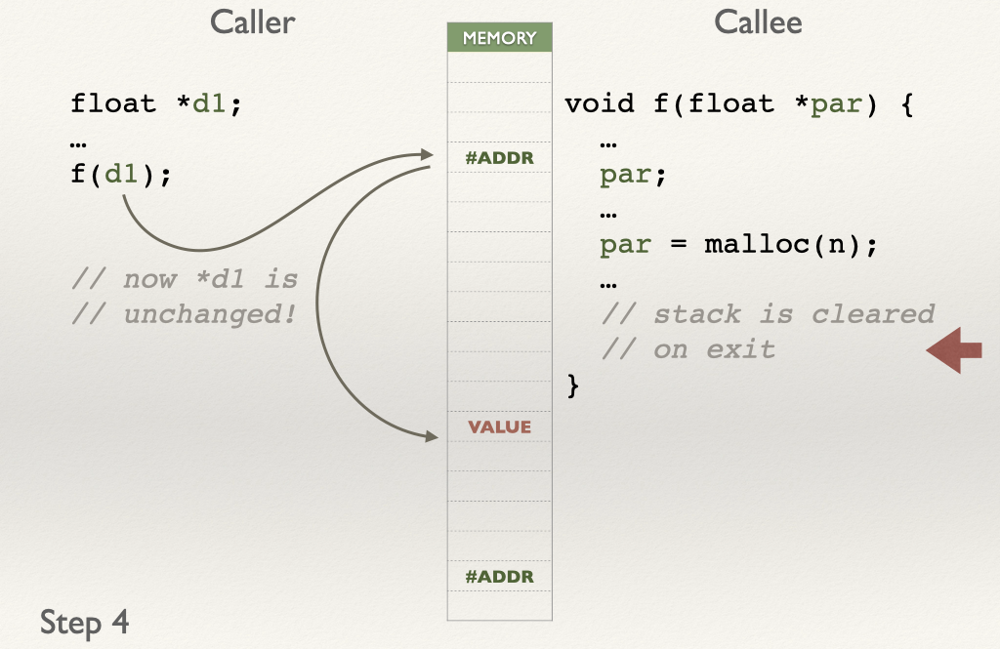{fig-align="center" height=540}

## NOT SO easy: Case TWO (working)

## Case two --- step 1

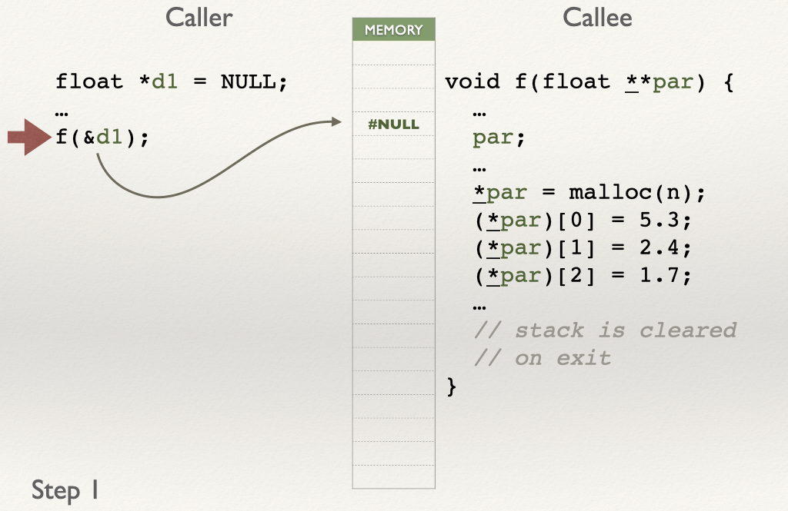{fig-align="center" height=540}

## Case two --- step 2

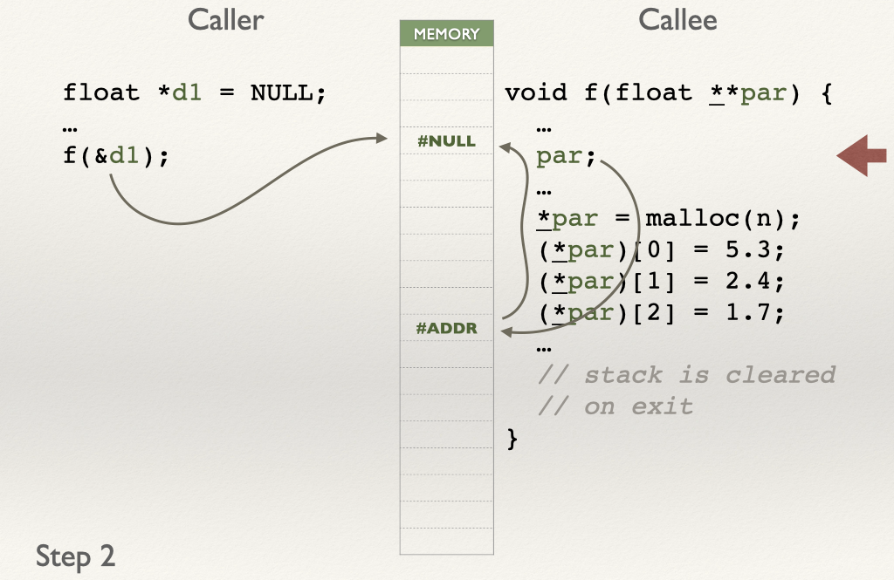{fig-align="center" height=540}

## Case two --- step 3

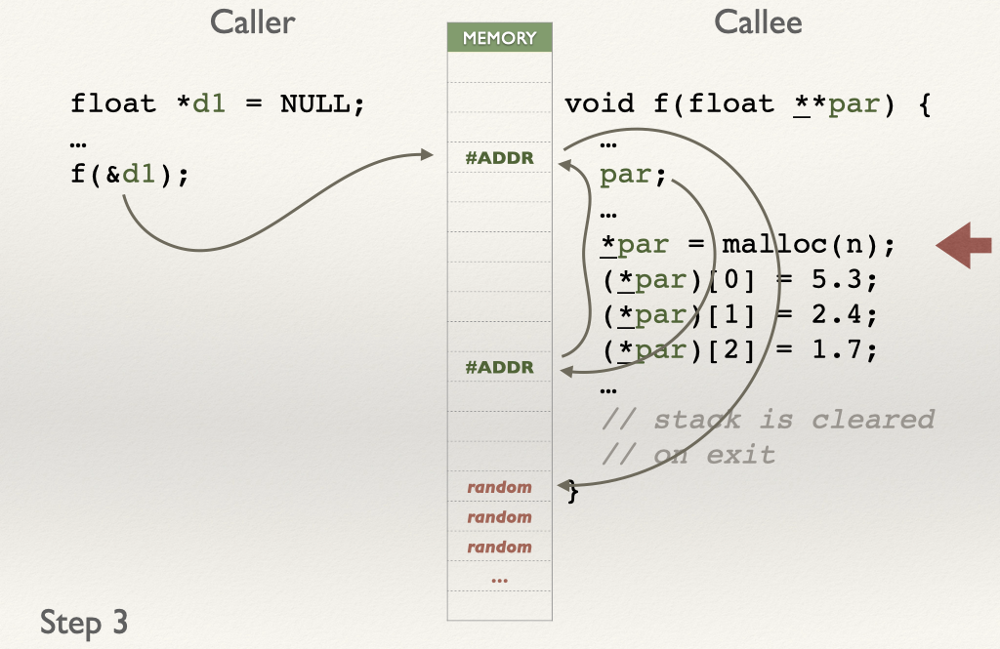{fig-align="center" height=540}

## Case two --- step 3 (cont.)

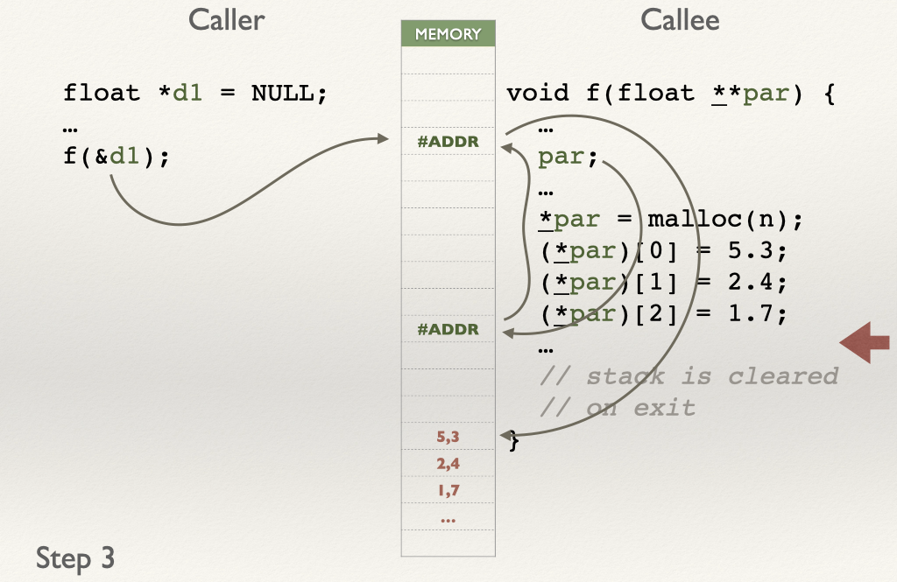{fig-align="center" height=540}

## Case two --- step 5

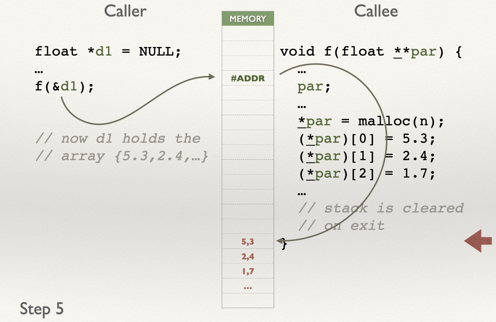{fig-align="center" height=540}

## Memory leaks

## Memory leaks --- step 3

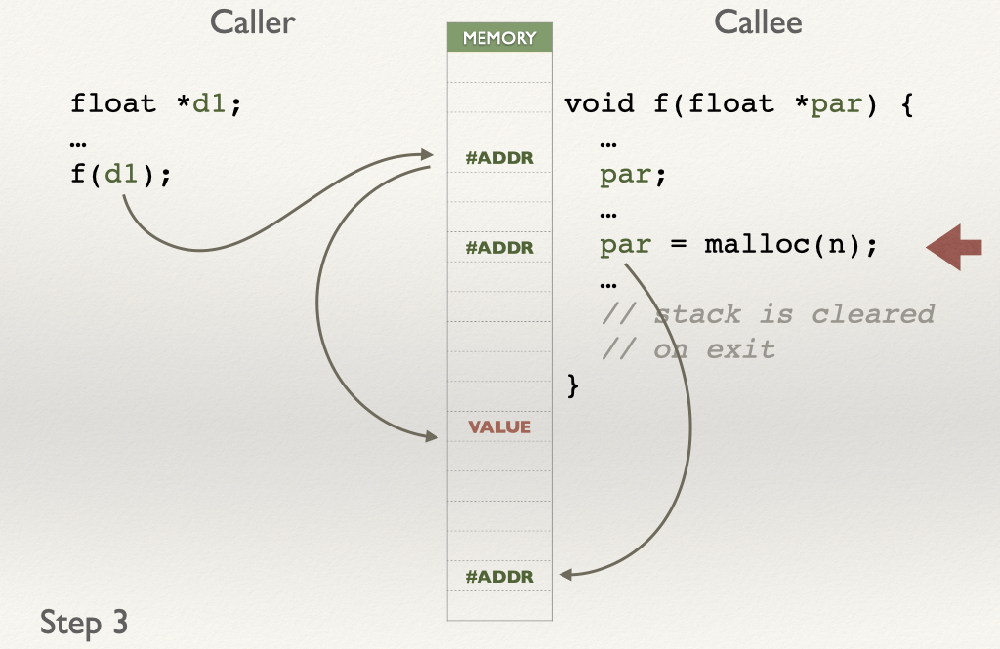{fig-align="center" height=540}

## Memory leaks --- step 4

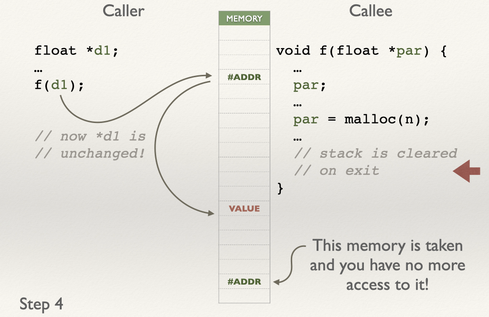{fig-align="center" height=540}

## Memory leaks {.smaller}

- There must be exactly one `free()` for every `malloc()`
- Sometimes the `malloc()` is implicit, e.g. `asprintf()` and similar functions (those that take double pointers for allocating and returning an array!)
- Leaked memory is restored on process exit
- **BUT**, long running processes **MUST** avoid memory leaks, especially when the leak occurs within loops

# MQTT basics

*MQ Telemetry Transport protocol --- using C language and Mosquitto broker*

{fig-align="center" height=300}

## MQTT protocol {.smaller}

- MQTT stands for **M**essage **Q**ueue **T**elemetry **T**ransport
- Actually, there is no queue but rather a **publish-subscribe** architecture
- The protocol is lightweight: it minimizes the overhead of messages
- It is about 100 times faster than REST HTTP messaging (in terms of maximum msg/s)
- It is not the fastest protocol (ZeroMQ is faster), but it is simple to implement and well balanced

## MQTT protocol {.smaller}

- In MQTT there are 3 different roles: **publisher**, **subscriber**, **broker**
  - The publisher is the information producer (to be implemented)
  - The subscriber is the information consumer (to be implemented)
  - The broker is a server that relays publisher messages to (possibly many) subscribers (already available)
- Messages are published under **topics**
- Topics are arranged hierarchically: `ccnc/x/pos`, `ccnc/y/vel`

## MQTT protocol {.smaller}

Subscribers can subscribe to more than one topic, possibly also using wildcards (`+` or `#`):

- `ccnc/+/pos` means any single word in between `ccnc` and `pos` (as `ccnc/x/pos` and `ccnc/y/pos`, but not `ccnc/x/nominal/pos`)
- `ccnc/#/pos` means anything (including multiple branches) under `ccnc` and ending with `/pos`

## MQTT protocol

- **Publishers** can publish messages to many different topics, but one at a time (no wildcards!)
- A message is also called a **payload**: any sequence of bytes, up to a maximum 268435456 bytes ($2^{28}$, ~**260 Mb**)
- Bigger payloads need to be split (or compressed)
- Messages are assigned with a quality of service level (**QoS**) and with an optional **retain flag**

## MQTT protocol {.smaller}

The QoS level states the reliability of a message:

- QoS 0: a message is delivered at most once
- QoS 1: a message is delivered at least once
- QoS 2: a message is delivered exactly once

QoS 0 is "fire-and-forget": less reliable but with minimum information exchange. QoS 2 has a delivery confirmation: 100% reliable, but slower

## MQTT protocol {.smaller}

- The **retain flag**, when set, instructs the broker to deliver the message to any subscriber connecting in the future
  - It is a kind of "last known value" clause
- There are also **last will and testament** (LWT) messages: these are messages delivered as soon as the broker detects that the client has disconnected
- *Note:* the roles of publisher and subscriber are semantic: any given process can simultaneously act as publisher and subscriber, if needed. Both are clients of the broker server

## MQTT Applications {.smaller}

- There are many available broker services, like mosquitto, Paho, HiveMQ, Mosca, EMQ X, VerneMQ.
- As well, there are many libraries for implementing MQTT clients (pub+sub) in virtually any known programming language
- We will refer to `mosquitto` (the broker) and `libmosquitto` (the C library)

## MQTT Broker {.smaller}

The mosquitto broker can be installed as a linux service, but it is much quicker and easier to use a docker container:

```bash
docker run -d --rm \
  --name mosquitto \
  -p 1883:1883 \
  -v "${PWD}/mosquitto.conf:/mosquitto/config/mosquitto.conf" \
  eclipse-mosquitto
```

- `-d --rm`: as daemon, remove on exit
- `--name mosquitto`: give it a name
- `-p 1883:1883`: expose port 1883
- `-v ...`: config file
- `eclipse-mosquitto`: name of the image

## MQTT Broker

The mosquitto config file (`mosquitto.conf`) typically contains at minimum:

```
allow_anonymous true
listener 1883
protocol mqtt
```

This accepts any connection. In production, you might want to require passwords and encrypted connections.

## MQTT library {.smaller}

- Documentation is on <https://mosquitto.org/api>
- The library namespace is `mosqpp`, the main class is `mosquittopp`
- Typical sequence of operation:
  - Start > library init > client init > client connect > set callbacks > loop { publish messages & update sockets } > free resources > stop
- **Callbacks** are methods automatically called on given events (e.g. successful connection, receiving subscribed message, ...)

## MQTT library

- **Library init:** `mosqpp::lib_init()`
  - It simply MUST be called before any other mosquitto call
- **Library cleanup:** `mosqpp::lib_cleanup()` (in destructor)

## MQTT library

- **Client init:** `auto mqt = mosquittopp(id, clean)`
  - `id`: can be a name (useful for debugging, only visible to the broker)
  - `clean`: ask the broker to delete all messages and subscriptions on disconnect
- Typically, you derive a class from `mosquittopp`

## MQTT library

- **Client connect:** `mosquittopp::connect(broker_addr, broker_port, keepalive)`
  - Connect the object to a given broker host and port
  - The broker pings the client (if no messages arrive) every `keepalive` seconds to verify if it is connected

## MQTT library

- **Implement callbacks:** `mosquittopp::on_message(const struct mosquitto_message *message)` (*et similia*)
  - Object calls `on_message` each time a message is received

## MQTT library {.smaller}

All network operations are just *scheduled* by subscribe and publish functions. They are actually performed in two alternative ways:

- By repeatedly/cyclically calling `mosquittopp::loop()` (preferred if you already have a loop)
- By starting a parallel thread that iteratively calls `mosquittopp::loop()`: this is done by calling `mosquittopp::loop_start()` just after `mosquittopp::connect()`

## MQTT library {.smaller}

- To schedule the publishing of a message, use `mosquittopp::publish(mid, topic, len, payload, qos, retain)`
  - The payload is any sequence of `len` bytes (a string or a binary object)
  - The message ID `mid` is typically `NULL`

## MQTT library {.smaller}

- When a message is received, the `on_message` callback is executed
- It gets the message as a `struct mosquitto_message`, which contains:
  - Message ID (if any), topic, payload, payload length, QoS level, retain flag.
- It does **not** contain any info on the publisher!
- The subscriber **HAS NO WAY** for identifying the publisher (unless it is written in the payload or topic)

## MQTT library

When done, you should, in this order:

1. Unsubscribe all subscriptions
2. Call `mosquittopp::loop` or `mosquittopp::loop_stop`
3. Disconnect from broker
4. Call `mosqpp::lib_cleanup`

## MQTT tools

:::: {.columns}
::: {.column width="45%"}
- The `mosquitto-clients` package installs the pair of commands `mosquitto_pub` and `mosquitto_sub`
- MQTT explorer is a useful graphical tool for tapping into MQTT dataflows: <http://mqtt-explorer.com>
:::
::: {.column width="55%"}
{height=430}
:::
::::

# Cargo Cult

*If it looks like a plane, that doesn't necessarily mean it can fly.* What you definitely don't want to do in engineering!

{fig-align="center" height=300}

## Cargo cult in anthropology

:::: {.columns}
::: {.column width="50%"}
- A **cargo cult** is a belief system, in which adherents perform rituals which they believe will cause a more technologically advanced society to deliver goods
- Many examples in remote Pacific islands, where inhabitants replicate US army "rituals" in the hope of calling a cargo delivery
:::
::: {.column width="50%"}
{height=230}

{height=230}
:::
::::

## Cargo Cult programming/engineering

Typical pattern:

- You don't know how to solve a problem
- You type "How to do *something* in *my language*?" in Google (or ChatGPT!)
- You end up on Stackoverflow (or similar sites) or get an AI-generated code
- You copy and paste the first solution, which you cannot fully understand but it seems to work

## Why is that a bad habit? {.smaller}

- At best, it messes up your coding style (e.g. using `variableNames` rather than `variable_names`)
- You may look amateur and naïve to those who read your code (among them, your prospective employer!)
- Foremost, you are losing control on your code, which may work fine in the stackoverflow/AI example, but much probably does hidden nasty things once embedded in your code
- Additionally, your problem understanding does not improve

## Doesn't happen only when you code {.smaller}

- There are many examples of cargo cult engineering as well
- Each time you accept an existing solution just because it works in another emplacement, and without fully understanding it, you are a cargo cultist
- Always question any solution; ask why; do not accept any solution that you cannot fully understand, at least in its outer structure (input/output relations, interfaces, specifications)

# Personal project: tool diameter compensation

*Complete this to skip the exam*

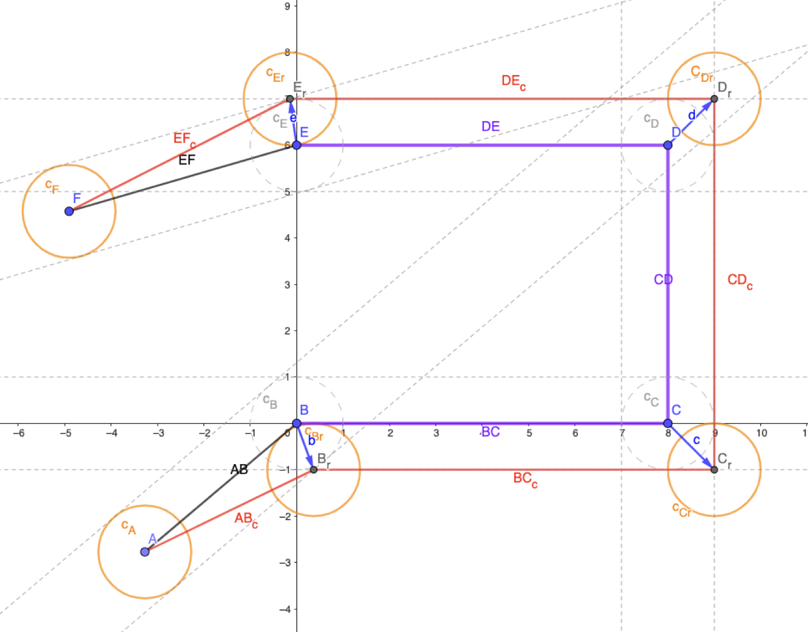{fig-align="center" height=380}

## Tool radius compensation {.smaller}

- G-code standard supports a feature for offsetting the tool trajectory to the left or to the right of the trajectory by an amount equal to the tool radius
- This is only affecting the X-Y projection of the trajectory, Z values remain unchanged
- The TRC is set to the left with `G41`, to the right with `G42` and is disabled with `G40`
- TRC is fully active at the end of the current block

## Tool radius compensation {.smaller}

:::: {.columns}
::: {.column width="50%"}
- TRC offsets the tool center path (programmed points) according to `G41`/`G42`
- New target points are calculated for each block on the basis of the offset intersection with the next block (arc or line)
- Disabled for rapid motions
:::
::: {.column width="50%"}
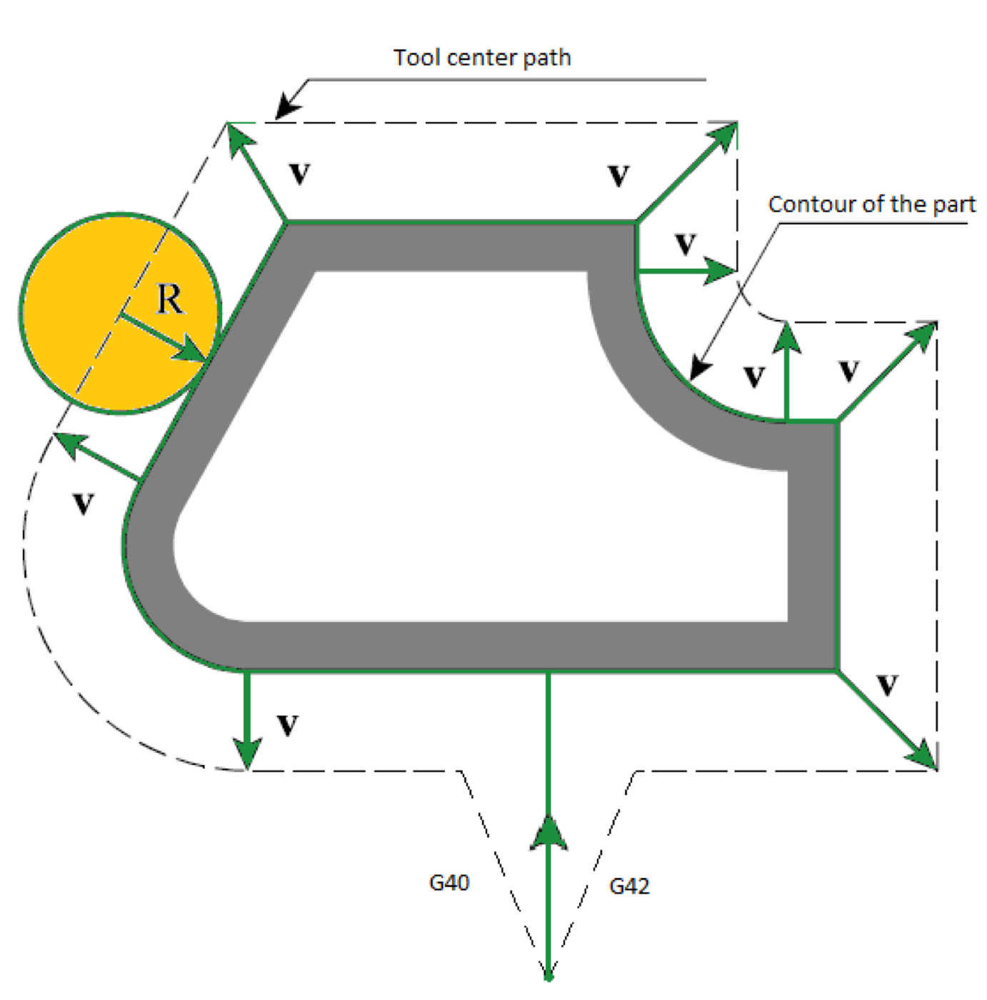{height=460}
:::
::::

## Tool radius compensation

{fig-align="center" height=470}

Interactive example on <https://www.geogebra.org/m/mcv4egvk>

## Tool radius compensation

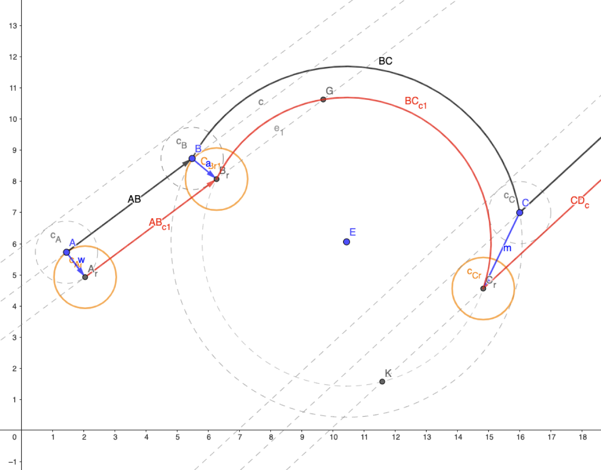{fig-align="center" height=470}

Interactive example on <https://www.geogebra.org/m/uwaa7u4v>

## Tool radius compensation

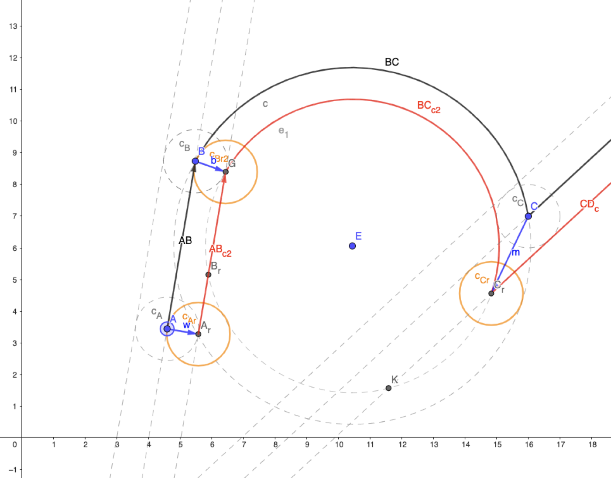{fig-align="center" height=470}

Interactive example on <https://www.geogebra.org/m/uwaa7u4v>

## Line-Line case {.smaller}

:::: {.columns}
::: {.column width="45%"}
We need to calculate the point $D$:

1. Given the line equation $y = ax + b$, we need to calculate the equation of the offset line(s)
2. Calculate $D$ as intercept between the two offset lines
:::
::: {.column width="55%"}
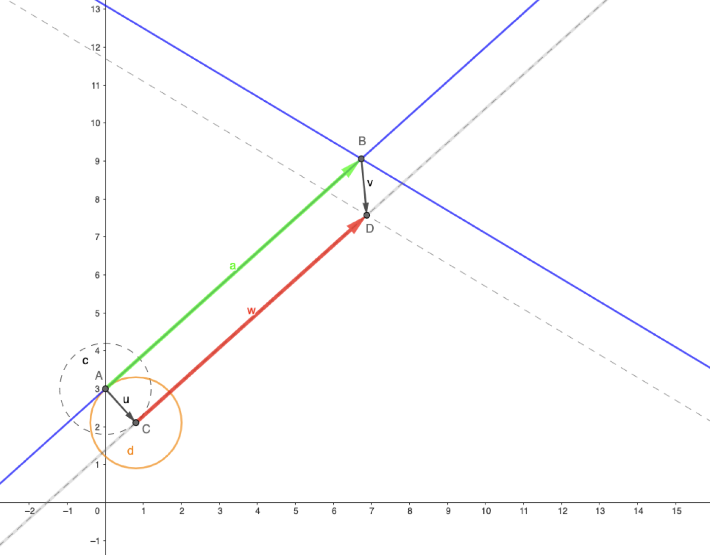{height=430}
:::
::::

## Line-Line case {.smaller}

:::: {.columns}
::: {.column width="55%"}
- Given $y = ax + b$, the equation of the offset line is $y = ax + b - v$
- Being $a = u/r$, it follows that: $v = \sqrt{u^2 + r^2} = r\sqrt{a^2 + 1}$
- So, $y = ax + b \pm r\sqrt{a^2 + 1}$
- **The sign depends on G41/G42 and on the path direction**
:::
::: {.column width="45%"}
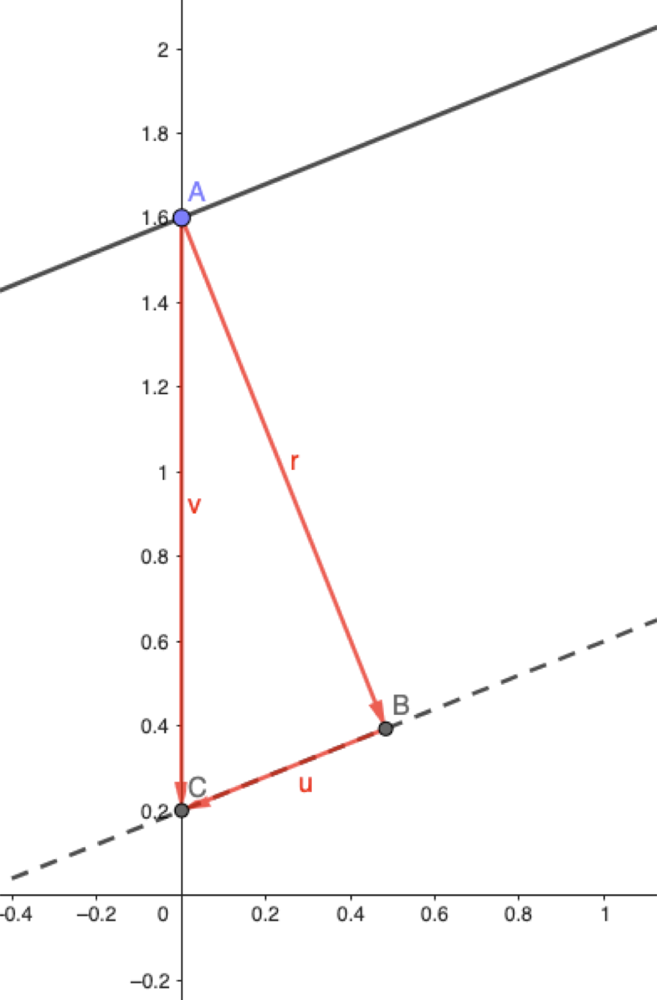{height=470}
:::
::::

## Line-Line case {.smaller}

:::: {.columns}
::: {.column width="55%"}
Intersection $D$ between

$y = a_1 x + b_1 - v_1 = a_1 x + b_{o,1}$

and

$y = a_2 x + b_2 - v_2 = a_2 x + b_{o,2}$

has coordinates:

$$(x_i, y_i) = \left(\frac{b_{o,2} - b_{o,1}}{a_1 - a_2}, \frac{b_{o,1}a_2 - b_{o,2}a_1}{a_2 - a_1}\right)$$
:::
::: {.column width="45%"}
{height=430}
:::
::::

## Line-Line case {.smaller}

:::: {.columns}
::: {.column width="58%"}
- **Exception:** when two segments are collinear ($a = a_1 = a_2$), the intercept is undefined
- The new intersection node is set at an offset $r$ **perpendicular** to the segments

$$C = \begin{cases} (0, -r), & \text{when } a = 0 \\ r(s, -s/a) \text{ with } s = \frac{a}{|a|}\sqrt{\frac{a^2}{1 + a^2}}, & \text{otherwise} \end{cases}$$

Interactive example on <https://www.geogebra.org/m/pmdtaprr>
:::
::: {.column width="42%"}
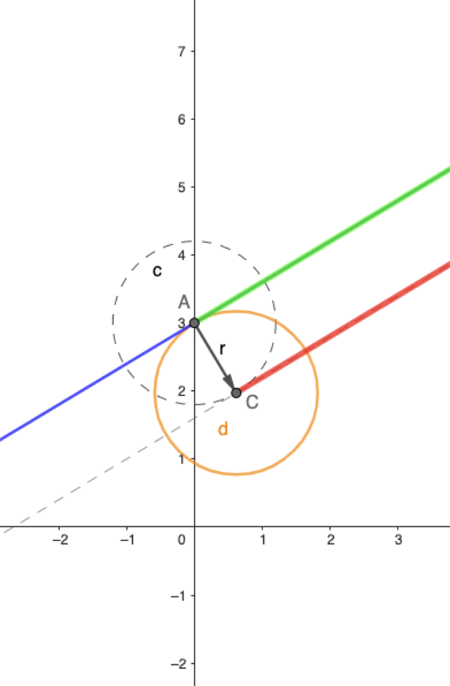{height=470}
:::
::::

## Line-Arc (or Arc-Line) case {.smaller}

:::: {.columns}
::: {.column width="55%"}
Similar to line-line case, but with a caveat:

- Line-circle intersection gives two points, $G$ and $B_r$: you have to select the intersection that is closer to the node to be offset ($B$ in figure)

Interactive example on <https://www.geogebra.org/m/uwaa7u4v>
:::
::: {.column width="45%"}
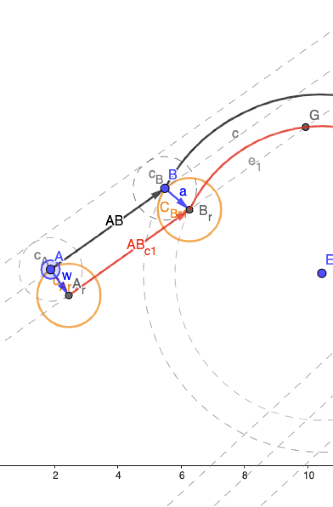{height=470}
:::
::::

## Line-Arc (or Arc-Line) case {.smaller}

:::: {.columns}
::: {.column width="55%"}
Similar to line-line case, but with a caveat:

- Line-circle intersection gives two points, $G$ and $B_r$: you have to select the intersection that is closer to the node to be offset ($B$ in figure)

Interactive example on <https://www.geogebra.org/m/uwaa7u4v>
:::
::: {.column width="45%"}
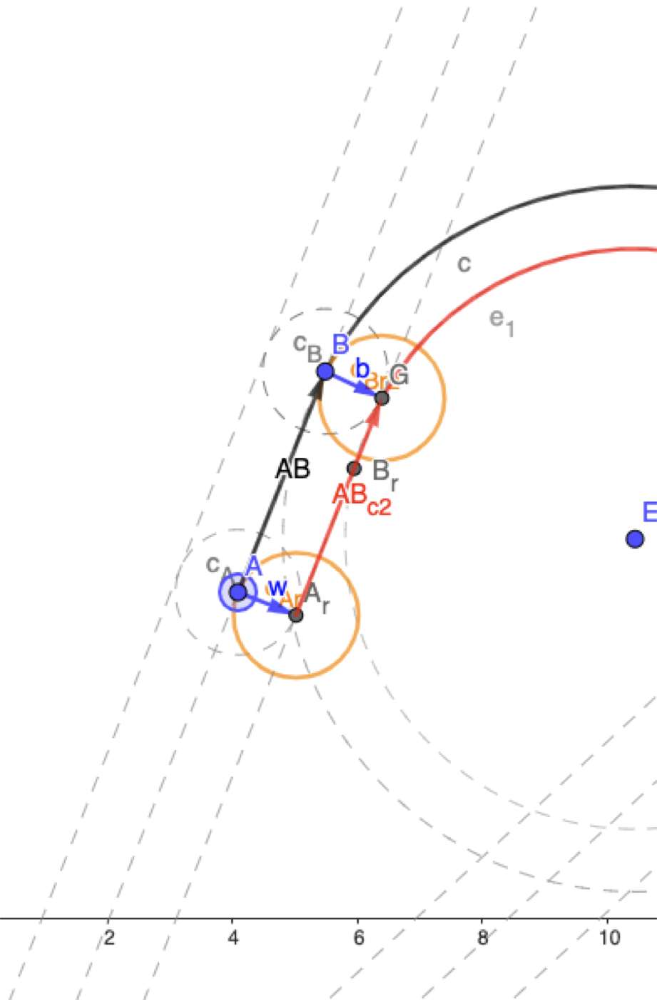{height=470}
:::
::::

## Code changes

**Support for G40/G41/G42**

- An `enum class TRCType` with `NONE`, `LEFT`, `RIGHT`
- An `TRCType _trc` field in the `BlockTRC` class
- Proper code in `BlockTRC::parse()`
- `_trc` shall be managed as a *modal* field (i.e. inherited from previous block)

## Code changes {.smaller}

**Support for tool radius**

- The YML file needs to have a field as: `tools: [10.0, 8.0, 5.0, 2.5]` giving the list of available tools and respective radiuses
- The `Machine` class needs to properly load the tool list into a new field: `vector<data_t> _tools`
- Add `machine::tool_radius()`, which returns the radius of a given tool number

## Code changes

**Support for offset calculation**

- The method `Block::parse()` needs to change the target of the previous block if the previous block has `_trc != TRCType::NONE`
- The target must be changed according to the equations shown above and the radius of the current tool

## Code changes {.smaller}

**Support for offset calculation**

- Equations for intersections possibly require:
  - `Block::angle_with_prev()`: angle in radians with previous block
  - `Block::equation()`: returns $a$ and $b$ as output parameters (refs); for an arc, parameters of the implicit equation $(x - x_c)^2 + (y - y_c)^2 = r^2$ are available already
- These functions can be private

## Advanced TRC

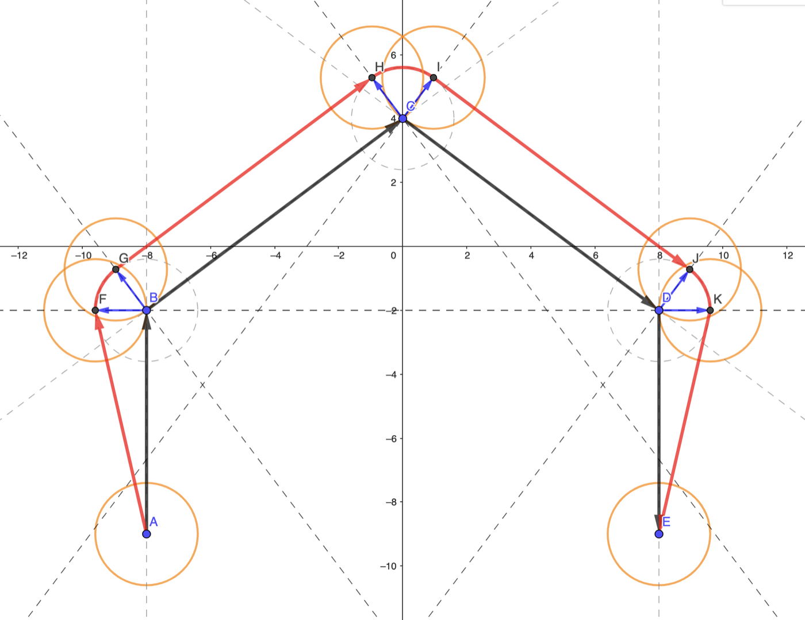{fig-align="center" height=560}

## Rules {.smaller}

- You must work alone (I'll check and compare results!)
- No help from my side, except these slides
- Set up a private GitHub repo and share it with me since the beginning
- When you are done, you must discuss your work with me
- If it works (no warnings) and it is not copied, you get 30/30
- If you implement advanced TRC or impress me with some other clever addition, you get 30/30 *cum laude*
- Must be done before the start of lessons in Sept. 2025
